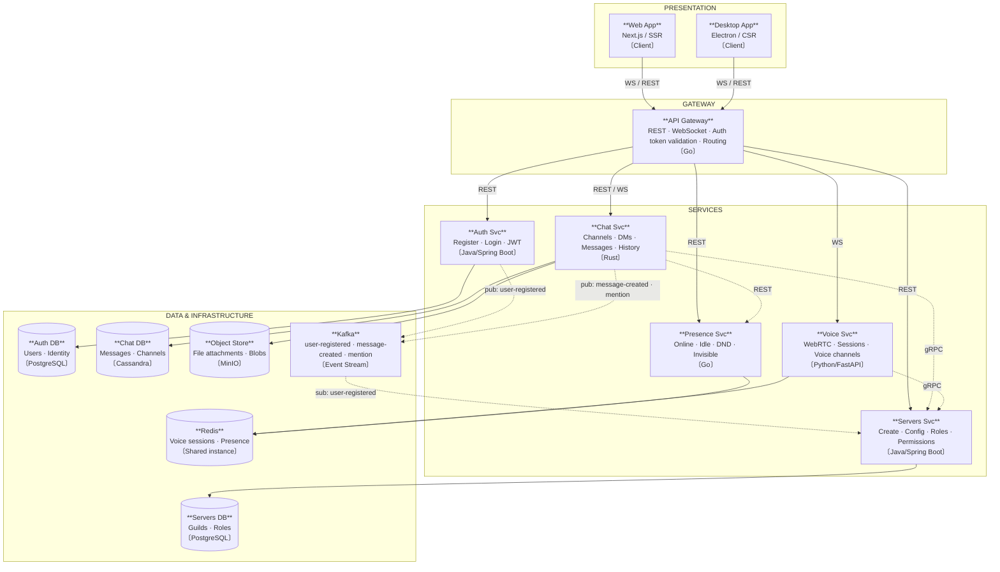
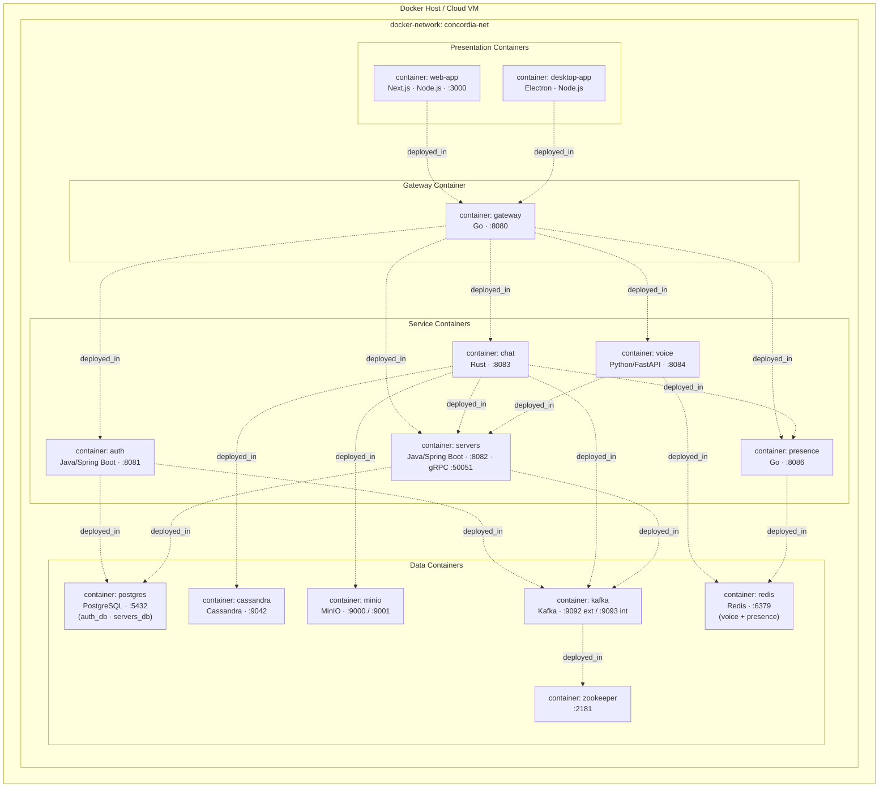
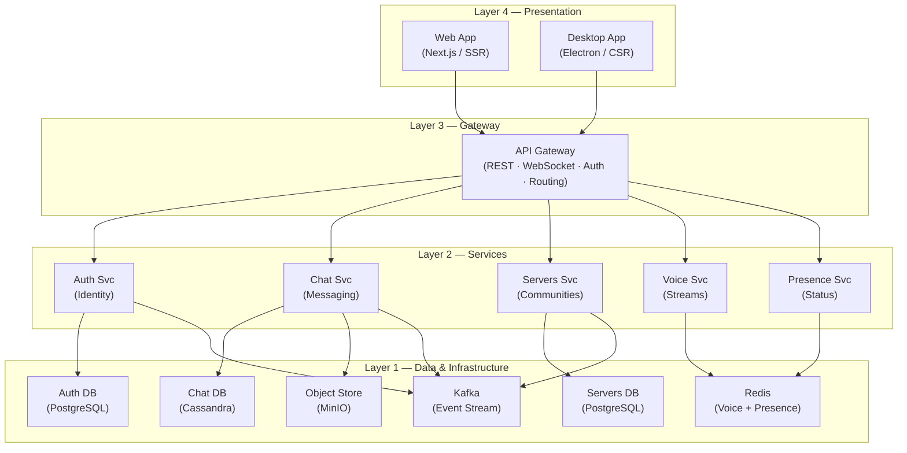

# Prototype 2 — Advanced Architectural Structure

**Software Architecture · 2026-I**
**Delivery date:** 2026-04-20

---

## 1. Team

**Team:** 2c

| # | Full Name |
|---|-----------|
| 1 | Daniel Felipe Ahumada Hernández |
| 2 | Juan Esteban Muñoz Muñoz |
| 3 | Daniel Fernando Mateus Vega |
| 4 | Jaime Darley Angulo Tenorio |
| 5 | Lina Sofía Espinal Daza |
| 6 | Jeremy Lee Halford Arroyo |
| 7 | Sebastián Castañeda García |

---

## 2. Software System

### Name

**Concordia**

### Logo

> *(Logo placeholder — replace with the Concordia logo image)*

### Description

Concordia is a real-time communication platform inspired by Discord. It allows users to create and manage community servers, exchange messages in text channels and direct messages, participate in voice channels via WebRTC, and track the online presence of other users. The system follows a distributed microservices architecture, with each domain (authentication, messaging, community management, voice, and presence) handled by an independent service, all orchestrated through a central API Gateway.

---

## 3. Architectural Structures

### 3.1 Component-and-Connector (C&C) Structure

#### C&C View



#### Description of Architectural Elements and Relations

**Components:**

- **Web App** — Presentation component implemented in Next.js with Server-Side Rendering (SSR). Acts as the primary browser-based client for end users.
- **Desktop App** — Presentation component built with Electron (Client-Side Rendering). Provides a native desktop experience.
- **API Gateway** — Infrastructure component implemented in Go. Acts as the single entry point for all client requests. Handles REST and WebSocket routing, authentication token validation, and rate limiting.
- **Auth Svc** — Logic component (Java/Spring Boot) responsible for user registration, login, JWT issuance, and friend relationships.
- **Chat Svc** — Logic component (Rust) that manages text channels, direct messages, message history, file attachments, and real-time WebSocket push.
- **Servers Svc** — Logic component (Java/Spring Boot) responsible for guild/server creation, channel management, roles, and permissions. Exposes a gRPC endpoint (`CheckPerm`) consumed by Chat Svc and Voice Svc.
- **Voice Svc** — Logic component (Python/FastAPI) that manages WebRTC signaling, voice sessions, and participant events.
- **Presence Svc** — Logic component (Go) that tracks user presence status (online, idle, DND, invisible) and session heartbeats.
- **Auth DB** — PostgreSQL data store for user identity and credentials (`auth_db` schema).
- **Chat DB** — Cassandra data store optimized for high-throughput message writes and history reads.
- **Servers DB** — PostgreSQL data store for guild and role data (`servers_db` schema).
- **Redis** — Shared NoSQL in-memory store used by Voice Svc (sessions) and Presence Svc (status/TTL).
- **Object Store** — MinIO S3-compatible blob store for file attachments uploaded through Chat Svc.
- **Kafka** — Asynchronous event broker. Carries `user-registered`, `message-created`, and `mention` events between services.

**Connectors:**

- **REST** — Synchronous request/reply HTTP connector used between the API Gateway and all backend services, and between Chat Svc and Presence Svc.
- **WebSocket (WS)** — Persistent bidirectional connector used by clients to the Gateway, and by the Gateway to Chat Svc and Voice Svc for real-time communication.
- **gRPC** — Synchronous remote procedure call connector used by Chat Svc and Voice Svc to invoke the `CheckPerm` operation on Servers Svc.
- **Pub/Sub (Kafka)** — Asynchronous event-driven connector. Auth Svc and Chat Svc publish events; Servers Svc subscribes to `user-registered`.

#### Description of Architectural Styles and Patterns Used

- **Microservices** — Each business domain (auth, chat, servers, voice, presence) is implemented as an independently deployable service with its own data store, following the database-per-service principle.
- **API Gateway pattern** — A single Gateway component centralises cross-cutting concerns (authentication, routing, rate limiting) and decouples clients from internal service topology.
- **Event-Driven Architecture** — Kafka decouples producers (Auth Svc, Chat Svc) from consumers (Servers Svc), enabling asynchronous processing of domain events.
- **Client–Server** — Clients (Web App, Desktop App) communicate with the backend exclusively through the API Gateway.

---

### 3.2 Deployment Structure

#### Deployment View



#### Description of Architectural Elements and Relations

**Environmental Elements:**

- **Docker Host / Cloud VM** — The physical or virtual machine that runs the Docker engine.
- **concordia-net** — A Docker bridge network that provides isolated communication between all containers.

**Software Elements (Containers):**

- `web-app` — Runs the Next.js SSR frontend, exposed on port 3000.
- `desktop-app` — Runs the Electron CSR client (local dev / packaged build).
- `gateway` — Runs the Go API Gateway, exposed on port 8080.
- `auth` — Runs the Java/Spring Boot Auth service on port 8081.
- `chat` — Runs the Rust Chat service on port 8083.
- `servers` — Runs the Java/Spring Boot Servers service on port 8082 (REST) and 50051 (gRPC).
- `voice` — Runs the Python/FastAPI Voice service on port 8084.
- `presence` — Runs the Go Presence service on port 8086.
- `postgres` — Runs a single PostgreSQL instance hosting both `auth_db` and `servers_db` schemas on port 5432.
- `cassandra` — Runs Cassandra on port 9042 for Chat Svc.
- `redis` — Runs a shared Redis instance on port 6379 for Voice and Presence services.
- `minio` — Runs MinIO object storage, API on port 9000 and console on port 9001.
- `kafka` — Runs the Kafka broker, accessible externally on port 9092 and internally on port 9093.
- `zookeeper` — Runs Zookeeper on port 2181 as required by Kafka for cluster coordination.

**Relations:** All relations are `deployed_in`, indicating which software components reside within which environmental containers at runtime.

#### Description of Architectural Patterns Used

- **Containerization pattern** — Every component of the system is packaged as a Docker container, ensuring environment consistency, isolation, and reproducibility across development and production.
- **Sidecar / shared infrastructure** — The single PostgreSQL container hosts multiple logical databases (`auth_db`, `servers_db`) and the single Redis container serves both Voice and Presence services, reducing infrastructure footprint for local development.

---

### 3.3 Layered Structure

#### Layered View



#### Description of Architectural Elements and Relations

**Layers:**

- **Layer 4 — Presentation** — Contains the user-facing components (Web App and Desktop App). This layer is responsible solely for rendering the UI and delegating all logic to the Gateway layer below.
- **Layer 3 — Gateway** — Contains the API Gateway, which acts as the single entry point. It handles cross-cutting concerns (authentication, routing, rate limiting) and dispatches requests to the appropriate service.
- **Layer 2 — Services** — Contains the five business logic microservices: Auth Svc, Chat Svc, Servers Svc, Voice Svc, and Presence Svc. Each service encapsulates a distinct bounded domain.
- **Layer 1 — Data & Infrastructure** — Contains all data stores (PostgreSQL, Cassandra, Redis, MinIO) and the event broker (Kafka). This layer provides persistence and asynchronous communication primitives consumed by the services above.

**Relations:** All arrows represent `allowed-to-use` dependencies, which are strictly unidirectional from a higher layer to a lower one. No lower layer uses a higher layer, and no cross-layer skipping occurs. Intra-layer (service-to-service) dependencies such as gRPC calls are an implementation detail captured in the C&C View, not represented here to preserve layering semantics.

#### Description of Architectural Patterns Used

- **Layered architecture (N-tier)** — The system is organized into four logical tiers with a strict unidirectional dependency rule, promoting separation of concerns, independent modifiability of each layer, and clear communication boundaries.
- **Strict layering** — No layer is allowed to skip layers or call upward, enforcing clean separation and minimizing coupling between non-adjacent concerns.

---

### 3.4 Decomposition Structure

#### Decomposition View

```mermaid
graph TD
    ROOT(["Concordia"])

    ROOT --> M_AUTH["Authentication Module"]
    ROOT --> M_CHAT["Chat Module"]
    ROOT --> M_SERVERS["Servers Module"]
    ROOT --> M_VOICE["Voice Module"]
    ROOT --> M_PRESENCE["Presence Module"]

    M_AUTH --> F1["f1: register"]
    M_AUTH --> F2["f2: login / logout"]
    M_AUTH --> F3["f3: token refresh"]
    M_AUTH --> F4["f4: get profile"]

    M_CHAT --> F5["f5: send message"]
    M_CHAT --> F6["f6: message history"]
    M_CHAT --> F7["f7: delete message"]
    M_CHAT --> F8["f8: file attachments"]
    M_CHAT --> F9["f9: mention fanout"]
    M_CHAT --> F10["f10: real-time WS push"]

    M_SERVERS --> F11["f11: create / manage server"]
    M_SERVERS --> F12["f12: manage channels"]
    M_SERVERS --> F13["f13: roles & permissions"]
    M_SERVERS --> F14["f14: membership"]
    M_SERVERS --> F15["f15: CheckPerm gRPC"]

    M_VOICE --> F16["f16: join / leave channel"]
    M_VOICE --> F17["f17: list participants"]
    M_VOICE --> F18["f18: WebRTC signaling"]
    M_VOICE --> F19["f19: participant events WS"]

    M_PRESENCE --> F20["f20: register WS session"]
    M_PRESENCE --> F21["f21: online indicator"]
    M_PRESENCE --> F22["f22: heartbeat / session TTL"]
    M_PRESENCE --> F23["f23: query by channel / user"]
```



#### Description of Architectural Elements and Relations

**Modules:**

- **Authentication Module** — Groups all functionalities related to user identity: account creation, credential validation, session token lifecycle, and profile retrieval.
- **Chat Module** — Groups all messaging functionalities: sending and deleting messages, browsing history, uploading file attachments, propagating mentions to interested parties, and pushing real-time updates via WebSocket.
- **Servers Module** — Groups all community management functionalities: creating and configuring servers, managing text/voice channels, defining roles and permissions, controlling membership, and exposing the `CheckPerm` gRPC operation used by other modules.
- **Voice Module** — Groups all real-time audio functionalities: joining and leaving voice channels, listing active participants, handling WebRTC signaling, and broadcasting participant state events.
- **Presence Module** — Groups all user status functionalities: registering active WebSocket sessions, displaying online indicators, maintaining session TTL via heartbeats, and querying presence by user or channel.

**Functionalities (f1–f23):** Each leaf node represents an atomic functionality implemented within its parent module. No functionality belongs to more than one module (single-parent constraint satisfied).

**Relations:** All edges represent `is-part-of`, indicating that each functionality or submodule is a constituent part of its parent module. The graph is acyclic and forms a strict tree rooted at Concordia.

---

## 4. Prototype

### Repository

```bash
# 1. Clone
git clone git@github.com:Lespinald/concordia-chat-app.git
cd concordia-chat-app

# 2. Configure environment
cp infra/.env.example infra/.env
# Edit infra/.env to override any defaults (all defaults work for local dev)
# Required: set JWT_SECRET to a 32+ character string before first run

# 3. Start the full stack
docker-compose --env-file infra/.env -f infra/docker-compose.yml up --build

# 4. Open the app
open http://localhost:3000
```
